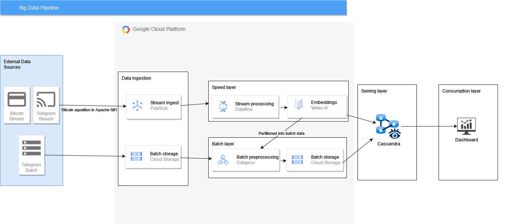

# Big Data Project

1. The project is held on Google Cloud platform.
2. Most of folder names correspond to GCP tools that were implemented inside them (for example, inside `dataproc` folder you can find scripts implementing dataproc jobs).
3. Other folders:
    - `dashboard` (for Streamlit Application with dashboard)
    - `notebooks` (for exploratory data analysis of telegram and cryptocurrency data sets)
    - `data` and `scraper` (for scraping data from Telegram)
    - `tests` (for unit tests on MS2)
  
# Architecture diagram

